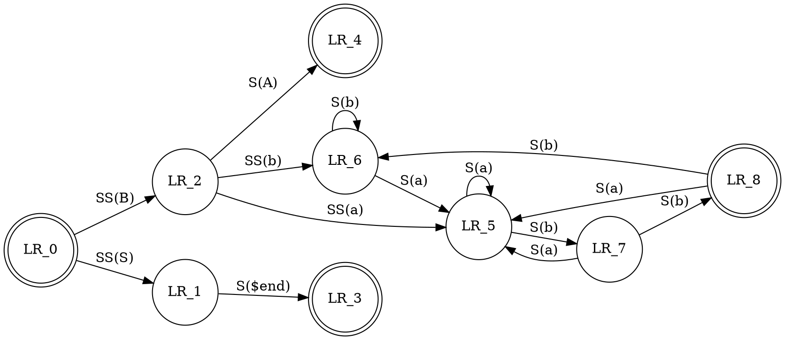

## Изучение работы Kroki

Kroki предоставляет унифицированный API с поддержкой BlockDiag (BlockDiag, SeqDiag, ActDiag, NwDiag, PacketDiag, RackDiag), BPMN, Bytefield, C4 (с PlantUML), Ditaa, Erd, Excalidraw, GraphViz, Mermaid, Nomnoml, Pikchr, PlantUML, Structurizr. , SvgBob, UMLet, Vega, Vega-Lite, WaveDrom... и многое другое!

Пример работы Kroki:

## Изучение работы microsoft threat modeling tool

Средство моделирования угроз — это основной элемент жизненного цикла Microsoft Security Development (SDL). Это позволяет разработчикам программного обеспечения выявлять и устранять потенциальные проблемы безопасности на ранней стадии, когда их решение относительно просто и рентабельно. В результате это значительно снижает общую стоимость разработки. Кроме того, мы разработали этот инструмент с расчетом на неспециалистов по безопасности, что упрощает моделирование угроз для всех разработчиков, предоставляя четкие рекомендации по созданию и анализу моделей угроз.

## Литература

https://kroki.io/
https://docs.gitlab.com/ee/administration/integration/kroki.html
https://docs.microsoft.com/en-us/azure/security/develop/threat-modeling-tool

